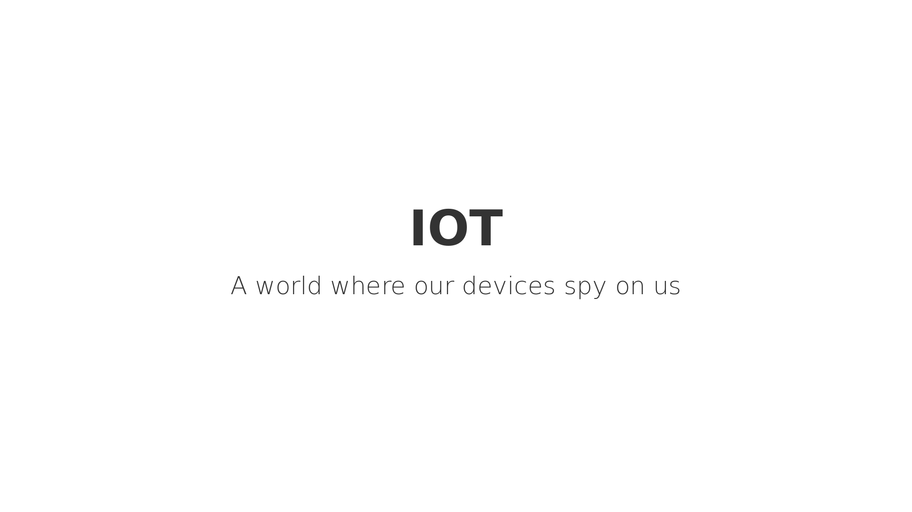
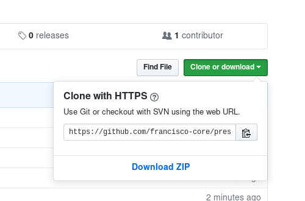

# IoT

-----

Introduction to the brave new world where not even in our homes we have privacy

----

The [**slides.md**](./slides.md) MarkDown is written for reveal.js, a tool that displays presentations as a webpage, To view the presentation open the file `index.html` in the web browser.

License [CC BY-SA 4.0](http://creativecommons.org/licenses/by-sa/4.0/)

---

# Getting Started

1. Either clone the presentation with `git clone --recursive https://github.com/francisco-core/presentation-iot` or click on the "Download ZIP" button:

2. open `index.html` in the browser and there your go.

You can use the arrows to move around the slides

# Contribute

If you wish to contribute to this presentation, please feel free to fork it and do a pull request

# Thanks

presentation done in the context of the local privacy group [privacyLx](https://privacylx.org), based in Lisbon, Portugal.