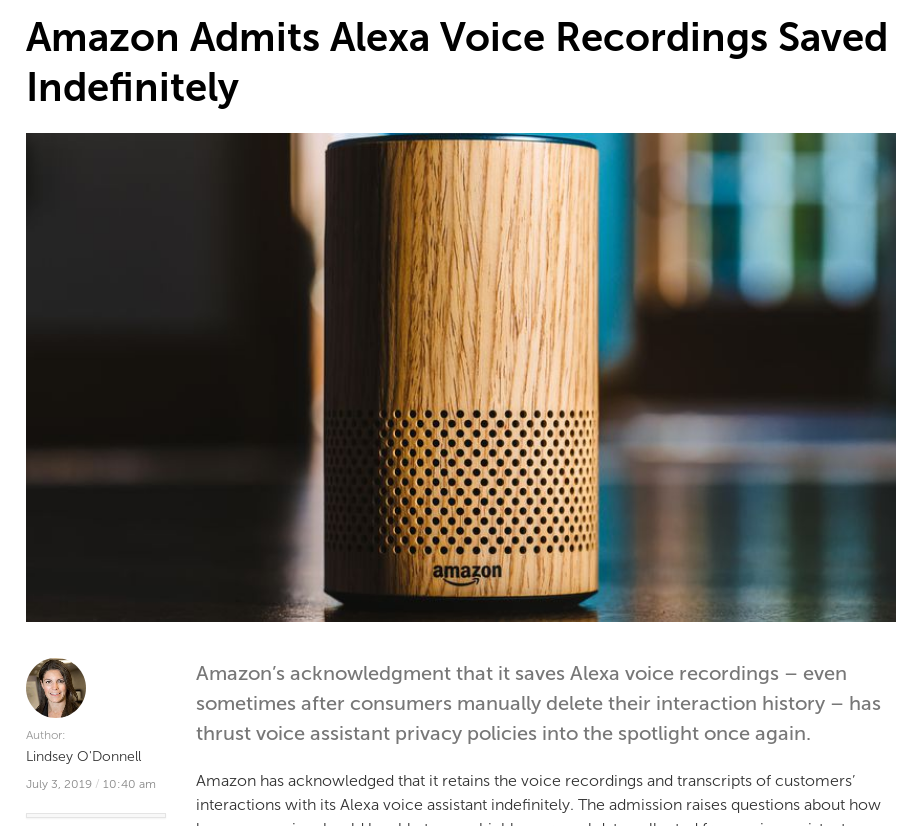

# IoT

A world where our devices spy on us

note:

The idea of this presentation is to give a general overview on the
privacy implications of leaving these "smart" devices into our homes

---

# TODO

A short introduction to privacy to make people aware that they do
value privacy and wouldn't just someone put a microphone in their
homes livestreaming everything that goes on there.

---

# Reality Check

Let's make sure we are all up to the same facts

---

Source: https://threatpost.com/amazon-admits-alexa-voice-recordings-saved-indefinitely/146225/

---

# TODO

Many more slides and their naration in the presenter's notes

---

# what can we do?